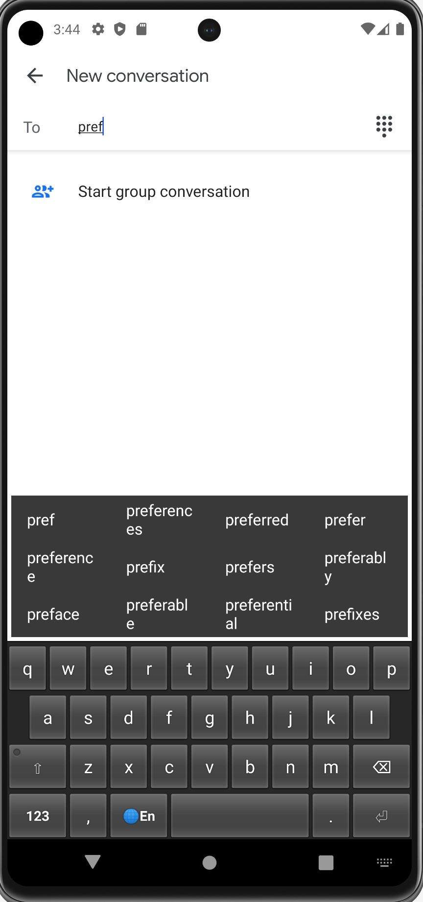
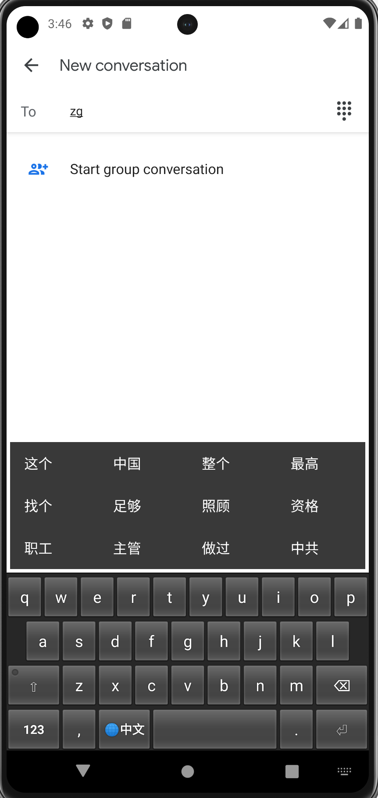

# Hallelujah-Android, 哈利路亚输入法 Android 版

基于 [Tiny Keyboard](https://github.com/rkkr/tiny-keyboard) 移植 [hallelujahIM](https://github.com/dongyuwei/hallelujahIM) 到 Android 平台。

目前已经完成功能：
- 英语单词自动补全；
- 英语单词拼写纠错建议：无匹配单词时，先按 Norvig 式编辑距离（增/删/换/相邻对调一字符）查 `words` 频率表给出候选，再经词典 Trie + Levenshtein DP 剪枝搜索最多 3 个编辑距离的词（覆盖双重/三重打字错误，按距离与词频排序），最后辅以 [Phonex](https://github.com/Yomguithereal/talisman) 音近词建议（与 macOS 版 hallelujahIM 相同机制）；
- 输入拼音（全拼），显示英语候选词列表；
- 切换到拼音输入模式（使用Google 拼音词库）以输出汉字；

词典数据与 macOS 版 [hallelujahIM](https://github.com/dongyuwei/hallelujahIM)、Windows 版 [Hallelujah-Windows](https://github.com/dongyuwei/Hallelujah-Windows) 共用同一套 SQLite 数据库：
- `words_with_frequency_and_translation_and_ipa.sqlite3`：英语单词频率表（`words` 表），首次启动时从 assets 复制到设备保护存储后只读查询；
- `pinyin_data.sqlite3`：拼音（全拼及首字母缩写）到汉字/词组表（`pinyin_data` 表），同样只读查询；
- `cedict.json` 仍保留在内存中，用于英文模式下无匹配单词时的拼音回退候选。

## 开发

- 构建：`./build-debug.sh` 构建 debug APK；`./build-release.sh` 构建 release APK（R8 混淆，未签名）；
- 单元测试：`./unit-test.sh`（等价于 `./gradlew testDebugUnitTest`，可追加过滤参数，如 `./unit-test.sh --tests "*DictionarySqlTest*"`）。覆盖两部分：候选词生成/排序/去重逻辑（`CandidateProviderTest`），以及用 [sqlite-jdbc](https://github.com/xerial/sqlite-jdbc) 直接对打包的 `.sqlite3` 词典运行与线上一致的 SQL 查询（`DictionarySqlTest`，验证词库内容与查询结果顺序）；
- CI：GitHub Actions（`.github/workflows/android.yml`）在代码变更时自动运行单元测试并构建 APK（`*.md` 等文档改动不触发），push 到 master 后自动创建 `build-<短SHA>` pre-release（标题含构建时间与短 SHA，说明中列出自上个 release 以来的提交记录），并附上 debug/release APK。

以下是 [Tiny Keyboard](https://github.com/rkkr/tiny-keyboard) 原始项目文档

# Tiny Keyboard

## About

- Smallest possible APK size of 26kB (as of version 0.7)
- Permissions: 0
- Supported layouts: en_US
- No Launcher icon and Settings
- Licensed under Apache License Version 2

## How it's made

Android OS contains a default [Keyboard](https://developer.android.com/reference/android/inputmethodservice/Keyboard) and [KeyboardView](https://developer.android.com/reference/android/inputmethodservice/KeyboardView) implementations (deprecated as of Android 10, but still available). Input method developers can use these classes as base for their own keyboard implementations. Tiny Keyboard is an implementation without any changes.

All that is contained in application source is key layouts and special handling for action keys.

## The future

The goal of this keyboard will stay a minimal size. Any functionality that doesn't increase the size drastically can be included. Check the Issues tab to see what is planned or request functionality.

Keyboard logic and view code may need to move into the application due to:

- Being deprecated in Android 10
- Implementations may differ across Android versions in a breaking way
- Implementations may differ across vendors in a breaking way
- Modifications are limited by exposed interfaces
- Provided implementation has bugs

## Downloads

## Credits

Based on https://android.googlesource.com/platform/development/+/master/samples/SoftKeyboard

AOSP Keyboard.java: https://android.googlesource.com/platform/frameworks/base/+/master/core/java/android/inputmethodservice/Keyboard.java

AOSP KeyboardView.java: https://android.googlesource.com/platform/frameworks/base/+/master/core/java/android/inputmethodservice/KeyboardView.java
