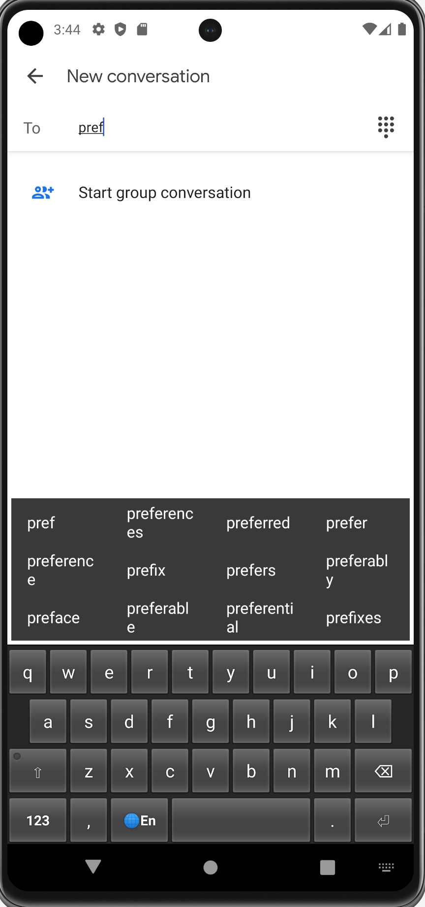
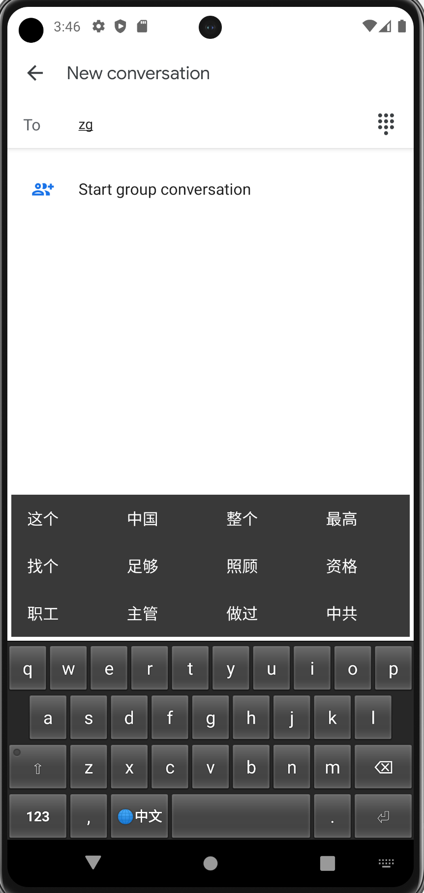

# Hallelujah-Android, 哈利路亚输入法 Android 版

基于 [Tiny Keyboard](https://github.com/rkkr/tiny-keyboard) 移植 [hallelujahIM](https://github.com/dongyuwei/hallelujahIM) 到 Android 平台。

目前已经完成功能：
- 键盘 UI 采用 [fcitx5-android](https://github.com/fcitx5-android/fcitx5-android) 风格的 **Pixel Dark** 主题（无边框 4dp 圆角按键、Material 图标、四类键色：普通/功能/空格/回车强调蓝、空格栏显示当前语言、暗色候选栏）；
- 英语单词自动补全；
- 英语单词拼写纠错建议：无匹配单词时，先按 Norvig 式编辑距离（增/删/换/相邻对调一字符）查 `words` 频率表给出候选，再经词典 Trie + Levenshtein DP 剪枝搜索最多 3 个编辑距离的词（覆盖双重/三重打字错误，按距离与词频排序），最后辅以 [Phonex](https://github.com/Yomguithereal/talisman) 音近词建议（与 macOS 版 hallelujahIM 相同机制）；
- 输入拼音（全拼），显示英语候选词列表；
- 切换到拼音输入模式以输出汉字：由 [librime](https://github.com/rime/librime) 的 **朙月拼音·語句流**（`luna_pinyin_fluency`，整句连续输入）方案驱动，rime.wasm 来自 [my_rime](https://github.com/LibreService/my_rime)，在纯 JVM 的 WebAssembly 运行时 [endive](https://github.com/bytecodealliance/endive) 上执行（无 NDK/JNI）；空格逐段确认、再按上屏整句，数字选词，中文标点自动整句上屏，用户词库自学习；启动时经内置 opencc 词典开启 `simplification`，输出**简体**；引擎启动期间先回退到内置 Google 拼音词库。

## 拼音模式（rime on WebAssembly）

拼音模式的引擎与数据来自开源项目 [LibreService/my_rime](https://github.com/LibreService/my_rime)（librime 的 WebAssembly 发行版，AGPL-3.0），感谢其作者的工作；在线体验版：<https://my-rime.vercel.app/>。

`app/src/main/java/rkr/tinykeyboard/inputmethod/rime/` 下实现了一个 Java 版的 Emscripten 宿主环境，让 [my_rime](https://github.com/LibreService/my_rime) 的 `rime.wasm`（`-fexceptions` + JS 文件系统构建）无需浏览器即可在 endive 上运行：

- `WasmVfs`：musl `__syscall_*` + WASI 文件操作，落到设备真实文件（词库与用户数据天然持久化）；
- `EmscriptenEh`：`__cxa_*`/`invoke_*` 的 C++ 异常与 longjmp 模拟（对照同版本 rime.js 逐函数移植）；
- `EmscriptenHost`：mmap（词库内存映射）、堆增长、时间、EM_ASM 等 113 个导入函数的总注册表；
- `RimeDataPack`：解包 Emscripten `--preload-file` 数据包（`rime.data` → opencc 字典、预编译 `default.yaml` 等）；
- `RimeWasmEngine`：init/set_ime/process 调用序列与 JSON 协议解析；
- `RimeController`：Android 侧资产安装（版本化、directBoot 存储适配）与主线程回调。

这套宿主层是纯 Java、不依赖 Android API，`RimeEngineIntegrationTest` 在桌面 JVM 上直接驱动真实 `rime.wasm` 完成「nihao → 你好」等端到端验收。更新 [my_rime](https://github.com/LibreService/my_rime) 产物时运行 `scripts/copy-rime-assets.sh ../my-rime-dist`（会同时从 rime.js 提取数据包文件清单）并提升 `RimeController.RIME_ASSETS_VERSION`。

词典数据与 macOS 版 [hallelujahIM](https://github.com/dongyuwei/hallelujahIM)、Windows 版 [Hallelujah-Windows](https://github.com/dongyuwei/Hallelujah-Windows) 共用同一套 SQLite 数据库：
- `words_with_frequency_and_translation_and_ipa.sqlite3`：英语单词频率表（`words` 表），首次启动时从 assets 复制到设备保护存储后只读查询；
- `pinyin_data.sqlite3`：拼音（全拼及首字母缩写）到汉字/词组表（`pinyin_data` 表），同样只读查询；
- `cedict.json` 仍保留在内存中，用于英文模式下无匹配单词时的拼音回退候选。

## 开发

- 构建：`./build-debug.sh` 构建 debug APK；`./build-release.sh` 构建 release APK（R8 混淆，未签名）；
- 单元测试：`./unit-test.sh`（等价于 `./gradlew testDebugUnitTest`，可追加过滤参数，如 `./unit-test.sh --tests "*DictionarySqlTest*"`）。覆盖两部分：候选词生成/排序/去重逻辑（`CandidateProviderTest`），以及用 [sqlite-jdbc](https://github.com/xerial/sqlite-jdbc) 直接对打包的 `.sqlite3` 词典运行与线上一致的 SQL 查询（`DictionarySqlTest`，验证词库内容与查询结果顺序）；
- CI：GitHub Actions（`.github/workflows/android.yml`）在代码变更时自动运行单元测试并构建 APK（`*.md` 等文档改动不触发），push 到 master 后自动创建 `build-<短SHA>` pre-release（标题含构建时间与短 SHA，说明中列出自上个 release 以来的提交记录），并附上 debug/release APK。

以下是 [Tiny Keyboard](https://github.com/rkkr/tiny-keyboard) 原始项目文档

# Tiny Keyboard

## About

- Smallest possible APK size of 26kB (as of version 0.7)
- Permissions: 0
- Supported layouts: en_US
- No Launcher icon and Settings
- Licensed under Apache License Version 2

## How it's made

Android OS contains a default [Keyboard](https://developer.android.com/reference/android/inputmethodservice/Keyboard) and [KeyboardView](https://developer.android.com/reference/android/inputmethodservice/KeyboardView) implementations (deprecated as of Android 10, but still available). Input method developers can use these classes as base for their own keyboard implementations. Tiny Keyboard is an implementation without any changes.

All that is contained in application source is key layouts and special handling for action keys.

## The future

The goal of this keyboard will stay a minimal size. Any functionality that doesn't increase the size drastically can be included. Check the Issues tab to see what is planned or request functionality.

Keyboard logic and view code may need to move into the application due to:

- Being deprecated in Android 10
- Implementations may differ across Android versions in a breaking way
- Implementations may differ across vendors in a breaking way
- Modifications are limited by exposed interfaces
- Provided implementation has bugs

## Downloads

## Credits

Based on https://android.googlesource.com/platform/development/+/master/samples/SoftKeyboard

AOSP Keyboard.java: https://android.googlesource.com/platform/frameworks/base/+/master/core/java/android/inputmethodservice/Keyboard.java

AOSP KeyboardView.java: https://android.googlesource.com/platform/frameworks/base/+/master/core/java/android/inputmethodservice/KeyboardView.java
